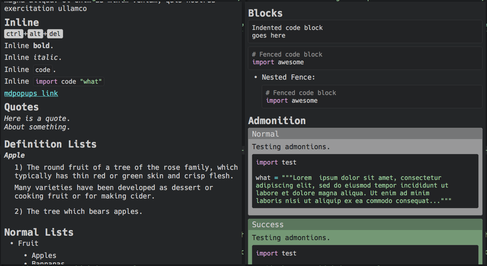

[![Unix Build Status][travis-image]][travis-link]
![License][license-image]
# Sublime Markdown Popups
Sublime Markdown Popups (mdpopups) is a library for Sublime Text plugins.  It utilizes the new plugin API found in ST3 Beta 3080+ for generating tooltip popups.  Mdpopups utilizes Python Markdown with a couple of special extensions to convert Markdown to HTML that can be used to create popups.  It also provides a number of other helpful API commands to aid in creating great tooltips.

Mdpopus provides both a dark and light CSS theme to style your popups, both of which can be overridden or extended.  Mdpopups will determine the brightness of your color scheme when deciding which theme to use.  If desired, a user can map their different color scheme files to custom tooltip CSS themes.

## Features

- Can take Markdown or HTML and create nice looking popup tooltips.
- Provides a dark and light theme.
- Uses the current Sublime color scheme of a view to create matching tooltip themes.
- Can create syntax highlighed code blocks easily using either Pygments or the built-in Sublime Text syntax highlighter automatically in the Markdown environment or outside via API calls.
- Can create color preview boxes via API calls.
- A CSS template environment that allows users to override and tweak the overall look of the tooltip theme to better fit their preferred look.  Using the template filters, users can generically access color scheme colors and manipulate them.
- Plugins can extend the current CSS to inject plugin specific class styling.  Extended CSS will be run through the template environment.

# Documentation

http://facelessuser.github.io/sublime-markdown-popups/

# License
Released under the MIT license.

Copyright (c) 2015 Isaac Muse <isaacmuse@gmail.com>

Permission is hereby granted, free of charge, to any person obtaining a copy of this software and associated documentation files (the "Software"), to deal in the Software without restriction, including without limitation the rights to use, copy, modify, merge, publish, distribute, sublicense, and/or sell copies of the Software, and to permit persons to whom the Software is furnished to do so, subject to the following conditions:

The above copyright notice and this permission notice shall be included in all copies or substantial portions of the Software.

THE SOFTWARE IS PROVIDED "AS IS", WITHOUT WARRANTY OF ANY KIND, EXPRESS OR IMPLIED, INCLUDING BUT NOT LIMITED TO THE WARRANTIES OF MERCHANTABILITY, FITNESS FOR A PARTICULAR PURPOSE AND NONINFRINGEMENT. IN NO EVENT SHALL THE AUTHORS OR COPYRIGHT HOLDERS BE LIABLE FOR ANY CLAIM, DAMAGES OR OTHER LIABILITY, WHETHER IN AN ACTION OF CONTRACT, TORT OR OTHERWISE, ARISING FROM, OUT OF OR IN CONNECTION WITH THE SOFTWARE OR THE USE OR OTHER DEALINGS IN THE SOFTWARE.

[travis-image]: https://img.shields.io/travis/facelessuser/sublime-markdown-popups/master.svg
[travis-link]: https://travis-ci.org/facelessuser/sublime-markdown-popups
[license-image]: https://img.shields.io/badge/license-MIT-blue.svg
